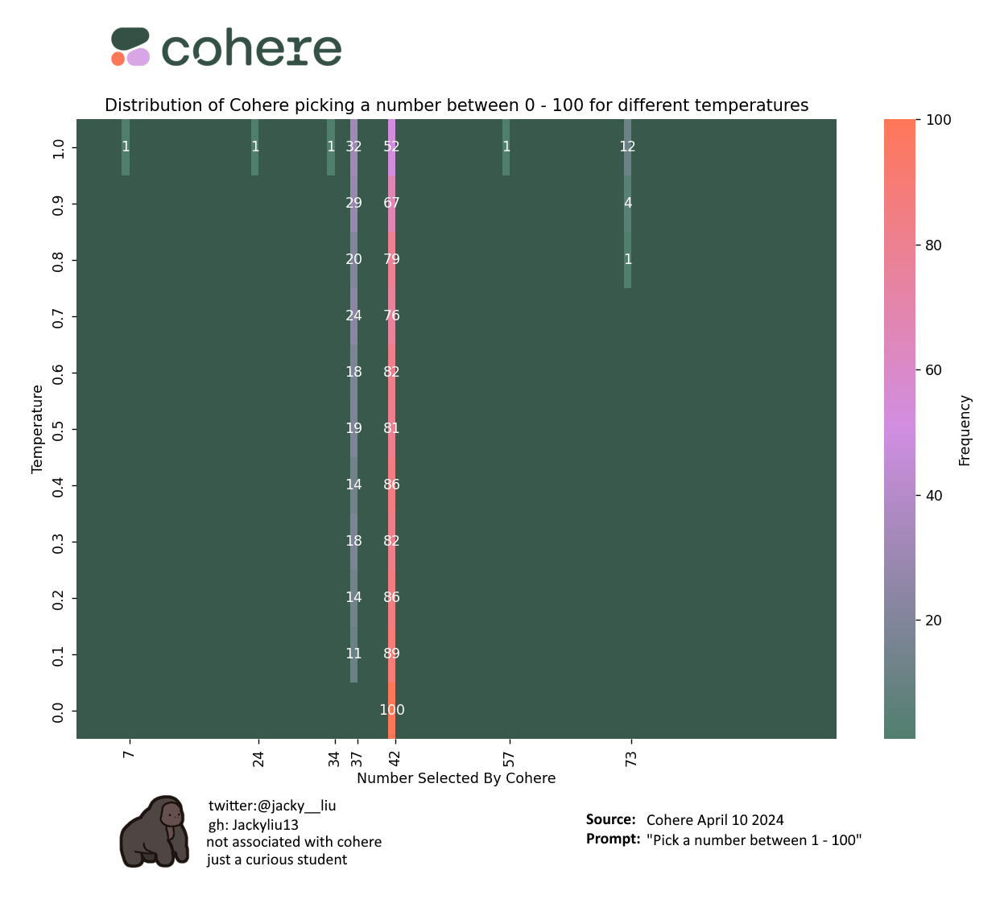

# What is Cohere favourite number?

Cohere's favourite number seems to be 42, and occasionally 37!

## Inspired by Leniolabs

<blockquote class="twitter-tweet"></blockquote> 

Seeing Leniolabs' experiment with ChatGPT on Twitter, I wanted to see what would be Cohere's results

## Experiment Design

1. main.py (generating numbers)  
   Using Cohere library from Python, I prompted Cohere to pick a number from 1 - 100
   <b>Prompt: Pick a Number between 1 - 100</b>
   I repeated this for each temperature setting from 0.0 - 1.0 on a 0.1 increment, similar to what Leniolabs performed on ChatGPT, but Cohere is limited to 1.0 as the max temperature.
   For each temperature setting I repeated the prompt 100 times, costed around 20 cents USD for the 1000 calls.
   Finally I stored all the generated values into a json!
2. plot.py (visualizing the data)  
   Similar to Leniolabs, I used a heatmap using libraries Matplotlib and Seaborn. The heatmap contains a visualization of the frequency of numbers selected by Cohere at different temperatures.
   It starts by reading a JSON file named 'numbers.json' into a dictionary. This file contains the data generated from main.py (previous step)
   Then calculates the frequency of each number selected at each temperature and stores this information in a Pandas DataFrame. The DataFrame is reindexed to ensure that all numbers from 1 to 100 are included, even if they were not present in the original data. Any missing numbers are filled with 0.
   I added a custom color map using Cohere's colour way for the heatmap, with green as the coolest and orange as the hottest temperatures.

## Why does it behave this way?

Doing a quick dive on the internet, it appears that both ChatGPT and Cohere picks 42 likely because of a reference to the science fiction series called the The Hitchhiker's Guide to the Galaxy. Within the series, 42 is significant because it is the answer given by a supercomputer to “the Ultimate Question of Life, the Universe, and Everything.” (MIT article). Therefore it become a popular number in the science fiction and technology communities, and it is often used as a placeholder for an unknown or unknowable answer.
